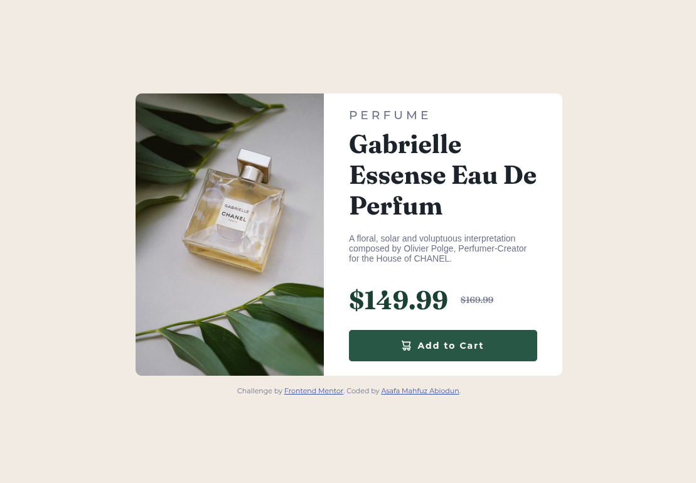

# Frontend Mentor - Product preview card component solution

This is a solution to the [Product preview card component challenge on Frontend Mentor](https://www.frontendmentor.io/challenges/product-preview-card-component-GO7UmttRfa). Frontend Mentor challenges help you improve your coding skills by building realistic projects. 

## Table of contents

- [Overview](#overview)
  - [The challenge](#the-challenge)
  - [Screenshot](#screenshot)
  - [Links](#links)
- [My process](#my-process)
  - [Built with](#built-with)
  - [What I learned](#what-i-learned)
  - [Continued development](#continued-development)
  - [Useful resources](#useful-resources)
- [Author](#author)
- [Acknowledgments](#acknowledgments)

**Note: Delete this note and update the table of contents based on what sections you keep.**

## Overview

### The challenge

The main challenge for me in this project was making sure the layout looks good on different devices. I had to work on the responsiveness so that the design adjusts properly whether it’s on a phone, tablet, or desktop.

Another part was adding hover and focus states to the button. This was important because it makes the page feel more interactive and shows the user when they are about to click something.

### Screenshot



### Links

- Solution URL: [Add solution URL here](https://your-solution-url.com)
- Live Site URL: [Netlify]("https://product-preview-card-9228.netlify.app/")

## My process

### Built with
- CSS custom properties
- Flexbox


### What I learned

From this project, I learned how to structure my HTML and style it with CSS to get a neat design. I also practiced creating a button with both text and an icon, which helped me understand better how to align elements inside a button.

I also improved in working with responsiveness. Using media queries, I was able to make the layout change on smaller screens, like stacking items and adjusting the font sizes so it still looks good. This really showed me how important it is to think about different devices when building a webpage.

Below are the code snippets;

```html
      <button>
          
          <h4>Add to Cart</h4>
        </button>
```
```css
@media screen and (max-width: 600px) {
    body {
        padding: 20px;
    }

    .card {
        flex-direction: column;
        height: auto;
    }

    .image img {
        width: 100%;
        height: 30vh; /* takes 30% of screen height */
        object-fit: cover;
        border-radius: 10px 10px 0 0;
    }

    .image-text {
        padding: 20px;
    }

    h2 {
        font-size: 28px;
    }

    .amount h4 {
        font-size: 28px;
    }
}
```

### Continued development

In future projects, I want to keep improving my responsiveness by practicing how layouts adapt smoothly across different screen sizes. I also plan to refine my use of media queries to handle multiple breakpoints more effectively, making sure designs remain consistent on both smaller and larger devices.

### Useful resources

- [W3schools](https://www.w3schools.com/css/css3_mediaqueries.asp) - This helped while getting the perfect details for my media query.
- [W3schools](https://www.w3schools.com/css/css_rwd_intro.asp) - This is helped me in getting the right details for my project to be responsive o differnt devices.
- [Youtube](https://www.youtube.com/watch?v=n9yI6fjkrfE&t=10s) - This helped me know what media query is all about for responsiveness.


## Author

- Website - [Add your name here](https://www.your-site.com)
- Frontend Mentor - [@LifeWithSpencer]("https://www.frontendmentor.io/profile/LifeWithSpencer")
- Twitter - [@lifewithspencer]("https://x.com/lifewithspencer?t=4cus2ODv5bB2Vp1TFgaOrA&s=08")


## Acknowledgments

I doph hat at Olamilekan(@OlamilekanAdewuyi) who joied me while I was doing this project for him to learn and also provided hints on where I was lagging to become better. I also appreciate SIYD-TECH (@SIYD-TECH) who helped while doing the responsiveness. I also appreciate @cyberwarbaby who also helped in the footer section to place it right for responsiveness.

